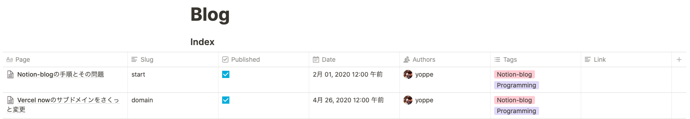

# My Notion Blog

Next.js の SSR・SSG を利用したブログ
Notion で書いた Page を元にブログの記事とする

[notion-blog](https://github.com/ijjk/notion-blog) を参考にアイデアを真似しました。
[react-notion](https://github.com/splitbee/react-notion) を使ってコードを整理しました。

## 機能

- notion で書いた記事をブログの記事として流用できる。
- "Link"に貼った自分の Notion のリンクを参照する機能
- 記事ごとのタグづけ
- sitemap を生成する API を実装
- firebase 追加によるアナリティクスが可能
- "strict": true へ変更
- Next.js 9.4 に更新ずみ

個人のブログだが機能追加や改修ごとの差分がわかりやすいよう、PullRequest をマージしていくことで改修する。

## 環境変数

### `.env`の記述

```
NOTION_TOKEN=<your-token>
BLOG_INDEX_ID=<your-blog-index-id>

BLOG_HOME_NOTION_URL=<your-notion-url>
BLOG_PROFILE_NOTION_URL=<your-notion-url>

NEXT_PUBLIC_FIREBASE_API_KEY=<your-api-key>
NEXT_PUBLIC_FIREBASE_AUTH_DOMAIN=<your-auth-domain>
NEXT_PUBLIC_FIREBASE_DATABASE_URL=<your-database-url>
NEXT_PUBLIC_FIREBASE_PROJECT_ID=<your-project-id>
NEXT_PUBLIC_FIREBASE_STORAGE_BUCKET=<your-storage-bucket>
NEXT_PUBLIC_FIREBASE_MESSAGING_SENDER_ID=<your-messaging-sender-id>
NEXT_PUBLIC_FIREBASE_APP_ID=<your-app-id>
NEXT_PUBLIC_FIREBASE_MEASUREMENT_ID=<your-measurement-id>

NEXT_PUBLIC_SITE_VERIFICATION=<your-verification-code>
```

NOTION*TOKEN,BLOG_INDEX_ID は notion のプライベート api から値を取得するために使う。
BLOG_HOME_NOTION_URL, BLOG_PROFILE_NOTION_URL はコンポーネントとして使う notion page の url
"NEXT_PUBLIC_FIREBASE*"から始まる環境変数は、firebase をプロジェクトに追加するために必要。

"NEXT*PUBLIC*"の prefix はがついたものは、バンドルに含まれる。
(https://nextjs.org/docs/basic-features/environment-variables#exposing-environment-variables)

### now secrets への追加

vercel でデプロイするため、now.json の記述が環境変数と対応する。
例えば"NOTION_TOKEN"は、"notion-token"としている。
これを次のようなコマンドで追加する必要がある。

```
vercel secrets add notion-token <token>
```

### When token is changed

Procedure when the token of notion changes

```
vercel secrets ls
vercel secrets rm notion-token
vercel secrets add notion-token <token>
```

## Creating Your Pages Table

### Manually Creating the Table

1. Create a blank page in Notion
2. Create a **inline** table on that page, don't use a full page table as it requires querying differently
3. Add the below fields to the table

#### properties

The table should have the following properties:

- `Page`: this the blog post's page
- `Slug`: this is the blog post's slug relative to `/blog`, it should be a text property
- `Published`: this filters blog posts in **production**, it should be a checkbox property
- `Date`: this is when the blog post appears as posted, it should be a date property
- `Authors`: this is a list of Notion users that wrote the post, it should be a person property
- `Tags`: This is the article tags
- `Link`: If you put your own Notion Page link here, the page reference will take precedence

Example


## Running Locally

1. Install dependencies `npm install`
2. Create and describe an `.env`
3. Run next in development mode `npm run dev`
4. Build and run in production mode `npm run build && npm run start`
