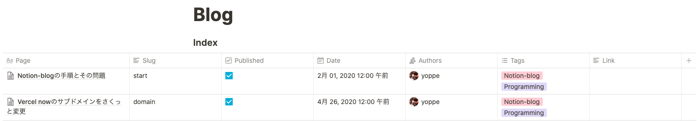

# My Notion Blog

ここでは、vercel 社の`notion-blog` をクローンして改修している。
[notion-blog](https://github.com/ijjk/notion-blog)

機能追加や改修ごとの差分がわかりやすいよう、PullRequestをマージしていくことで改修する。

## 機能 
[notion-blog](https://github.com/ijjk/notion-blog)からの変更点

- "Link"に貼った自分のNotionのリンクを参照する機能
- firebase 追加によるアナリティクスが可能
- "strict": true へ変更
- Next.js 9.4に更新ずみ

## 環境変数

### `.env`の記述

```
NOTION_TOKEN=<your-token>
BLOG_INDEX_ID=<your-blog-index-id>

NEXT_PUBLIC_FIREBASE_API_KEY=<your-api-key>
NEXT_PUBLIC_FIREBASE_AUTH_DOMAIN=<your-auth-domain>
NEXT_PUBLIC_FIREBASE_DATABASE_URL=<your-database-url>
NEXT_PUBLIC_FIREBASE_PROJECT_ID=<your-project-id>
NEXT_PUBLIC_FIREBASE_STORAGE_BUCKET=<your-storage-bucket>
NEXT_PUBLIC_FIREBASE_MESSAGING_SENDER_ID=<your-messaging-sender-id>
NEXT_PUBLIC_FIREBASE_APP_ID=<your-app-id>
NEXT_PUBLIC_FIREBASE_MEASUREMENT_ID=<your-measurement-id>
```

NOTION_TOKEN,BLOG_INDEX_IDはnotionのプライベートapiから値を取得するために必要。"NEXT_PUBLIC_FIREBASE_"から始まる環境変数は、firebaseをプロジェクトに追加するために必要。

"NEXT_PUBLIC_"のprefixはがついたものは、バンドルに含まれる。
(https://nextjs.org/docs/basic-features/environment-variables#exposing-environment-variables)

### now secretsへの追加
nowでデプロイするため、now.jsonの記述が環境変数と対応する。
例えば"NOTION_TOKEN"は、"notion-token"としている。
これを次のようなコマンドで追加する必要がある。

```
now secrets add notion-token <token>
```

### When token is changed

Procedure when the token of notion changes

```
now secrets ls
now secrets rm notion-token
now secrets add notion-token <token>
```

## Creating Your Pages Table

### Manually Creating the Table

1. Create a blank page in Notion
2. Create a **inline** table on that page, don't use a full page table as it requires querying differently
3. Add the below fields to the table

#### originals

The table should have the following properties:

- `Page`: this the blog post's page
- `Slug`: this is the blog post's slug relative to `/blog`, it should be a text property
- `Published`: this filters blog posts in **production**, it should be a checkbox property
- `Date`: this is when the blog post appears as posted, it should be a date property
- `Authors`: this is a list of Notion users that wrote the post, it should be a person property

#### extentions

こちらは本リポジトリで追加した機能なので自分で追加する:

- `Tags`: This is the article tags
- `Link`: If you put your own Notion Page link here, the page reference will take precedence

Example
  

## Running Locally

1. Install dependencies `yarn`
2. Create and describe an `.env`
3. Run next in development mode `yarn dev`
4. Build and run in production mode `yarn build && yarn start`

## Acknowledgments

[notion-blog](https://github.com/ijjk/notion-blog) リポジトリより引用。ありがとうございます。Vercel は神。

> - Guillermo Rauch @rauchg for the initial idea
> - Shu Ding @shuding\_ for the design help
> - Luis Alvarez @luis_fades for design help and bug catching
